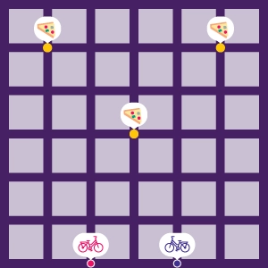

# Pizza City Rules

<time>Updated 01.15.2023</time>

> Become the pizza (delivery) champion in an ever-changing city.

## Components
* 56 card Bike Deck
* 60 card City Deck
* Board with roads and city blocks
* 2 Bike Tokens
* 7 Pizza Drop-Off Tokens
* 4 Reference cards

## Goal

Be the first team to deliver 3 pizzas, as represented by collecting 3 Pizza Drop-Off Tokens.

## Setup

1. Separate yourselves into teams of 2. Each team will have 1 City Player and 1 Bike Player. Take the turn indicator card that corresponds to your team and role.
2. Place the 2 Bike Tokens and 3 of the Pizza Drop-Off Tokens at the locations indicated in the image below   
    
3. Each City Player draws 3 City Cards from the City Deck
4. Each Bike Player draws 5 Bike Cards from the Bike Deck
5. Starting with the Red City player, take turns in turn order

### Turn Order
1. Red City
2. Blue Bike
3. Blue City
4. Red Bike

## City Player Turn
Each City Player is trying to help their teammate and hinder the opposing Bike Player.

On their turn, the City Player places 2 City Cards onto the board.

Then the City Player draws two City Cards.

### Playing a City Card
When a City Player plays a City Card, they place it so that the city blocks cover the city blocks that are beneath the card. This typically covers two blocks and one road.

However, a City Player may choose to place a card on the edge of the board so that one of the city blocks hangs off of the edge. This block cannot be accessed as there are no roads leading off of the board.

A City Player may not place a City Card entirely over another single City Card. That is, a City Card cannot cover both city blocks of another City Card.

#### City Features

| name | description |
|---|---|
| Building | Bikes cannot move through Buildings. |
| Park | Bikes can move diagonally through Parks. |
| Road | Bikes can move across in either direction. |
| One-way | Bikes can move across this road going one way, but not the other. |
| Bike Lane | Bikes gain +1 extra block of movement when moving across this road. |
| Stop Sign | When a bike reaches a corner with a stop sign, it must immediately stop moving. |
| Subway/T Stop | A subway ticket can be used to go to any other subway stop. |

## Bike Player Turn
Each Bike Player is trying to reach 3 pizza drop-off locations before the other Bike Player.

On their turn, the Bike Player plays 2 Bike Cards. They may also activate Flair Cards.

Then the Bike Player draws 2 Bike Cards.

### Playing a Bike Card
There are two types of Bike Cards: Move and Flair.

When a Bike Player plays a Move Card, they move the bike on the board that many blocks in a straight line. If there are any obstacles on that path, the bike will stop before completing the full move. Otherwise, the Bike Player must move the entire move value.

When a Bike Player plays a Flair Card, they place it on the table in front of them. This counts as one of the two Bike Cards played this turn.

At any point during their turn, the Bike Player may discard a Flair Card from the table in order to take its effect. Activating the Flair Card does not count as one of the two Bike Cards played this turn. There is no limit to how many Flair Cards you can have in play, nor to how many you can activate at the same time.

You cannot be on the same corner as another Bike Player. If your move would cause you to end on the same corner as another Bike Player, stop at the corner before. You can move through other Bike Players. You cannot use Subway Tickets to go to the same corner as another Bike Player.

#### Flair Cards

| name | description |
|---|---|
| Ticket | When at a corner with a Subway Stop, discard this to move to any other Subway Stop |
| Boost | When you Move, move +1 Block |
| Juke | You can turn once during movement |
| Nonstop | Ignore one STOP sign |
| Anyway | Ignore one ONE WAY marking |
| Shortcut | You may Move diagonally through a building |
| Style | Play one additional action |
| Toss | You can deliver one pizza during your Move card’s use, before ending your Move |

### Delivering a Pizza
If at the end of a move, a Bike Player is on the same corner as a Pizza Drop-Off Token, they remove the Pizza Drop-Off Token from the board. They have successfully delivered a Pizza.

At the end of this turn, the opposing city player places a new Pizza Drop-Off Token on the board. This new Pizza Drop-Off Token can be placed anywhere on the board, so long as it is more than 2 spaces away from both bikes and more than 1 space away from all other Pizza Drop-Off Tokens.

If all seven Pizza Drop-Off Tokens have been placed on the board, do not add any more.

## Teamwork
Each Bike Player and City Player are working together as a team. So as a City Player, you want to create opportunities so the Bike Player can deliver a Pizza, while closing off paths for the opposing Bike Player.

As the Bike Player, you want to set yourself up to be open to these opportunities.

At any point, you are allowed to communicate with your partner to strategize. However, all communication must be public, no secret communication is allowed. Under no circumstance can you show the cards in your hand to any other player.

## Game End
When a Bike Player has delivered their third Pizza, the game immediately ends. The Bike Player and their City Player ally both win the game.

Celebrate by ordering a pizza, or at least considering it.